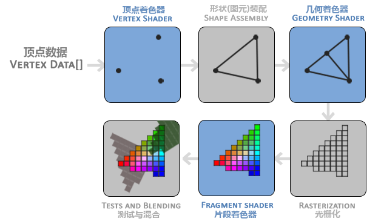
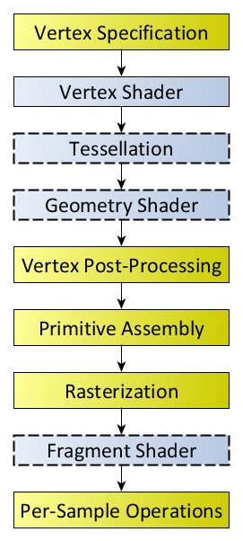
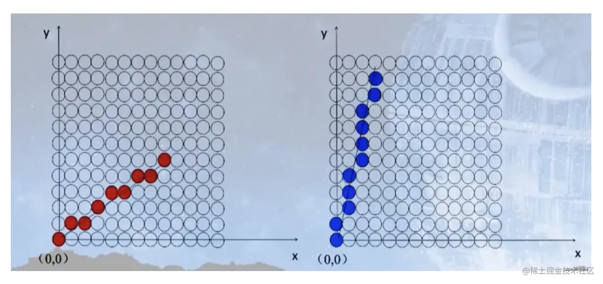
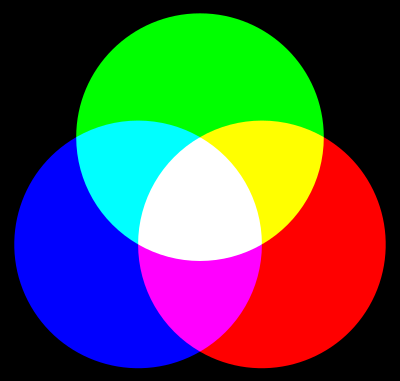
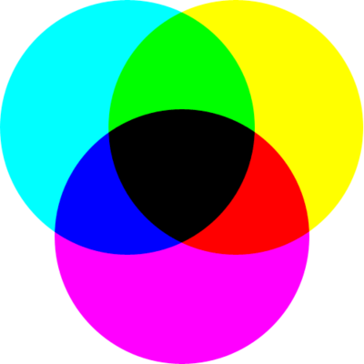

# 渲染学习

## [图形渲染流水线 Rendering/Graphic Pipeline][10]
GPU 图形渲染流水线的具体实现可分为六个阶段：
1. 顶点着色器（Vertex Shader）
2. 形状装配（Shape Assembly），又称 图元装配
3. 几何着色器（Geometry Shader）
4. 光栅化（Rasterization）
6. 片段着色器（Fragment Shader）
6. 测试与混合（Tests and Blending）

### [着色器 Shader][5]
计算机图形学领域中，着色器（英语：shader）是一种计算机程序，原本用于进行图像的浓淡处理（计算图像中的光照、亮度、颜色等），但近来，它也被用于完成很多不同领域的工作，比如处理CG特效、进行与浓淡处理无关的影片后期处理、甚至用于一些与计算机图形学无关的其它领域。
#### 顶点着色器
顶点着色器是最常见的一种 3D 着色器，对每个交给图形处理器的顶点都运行一次。目的是将每个顶点在虚拟空间中的 3D 坐标变换到在屏幕上显示的 2D 坐标（深度缓冲（Z-Buffer）的深度值也是如此）。顶点着色器可以掌控顶点的位置、颜色和纹理坐标等属性，但无法生成新的顶点。顶点着色器的输出传递到流水线的下一步。如果有之后定义了几何着色器，则几何着色器会处理顶点着色器的输出数据，否则，光栅化器继续流水线任务。

### [光栅化 Rasteruzation][1]
光栅化可以简单理解成如何将图像或者物体所蕴含的几何信息呈现在屏幕，比如：对于一个三角形来说需要用屏幕空间上哪些点的集合来表示它（用离散的点集来表示连续的线条或图像）

## [垂直同步 Vsync][3]
对于一帧画面，在屏幕上的显示是按照先从左往右扫描完一行，然后从上往下扫描下一行的顺序来渲染的。当扫描完一屏之后，需要重新回到第一行继续刚才的过程，而在进入下一轮扫描之前有一个空隙，这段空隙时间叫做 VBI（Vertical Blanking Interval）。在 VBI 期间，正好就是用于生成帧的最佳时间。而要保证这一点，我们需要在一屏扫描完进入下一轮扫描之前，即在一个 VBI 的开始时刻通知 CPU/GPU 去立即产生下一帧。恰好，硬件会在这个时刻触发垂直同步脉冲（Vertical Sync Pulse），正好可以用来进行通知，这个机制就叫 Vsync。  
Vsync 机制只保证了生成时机和显示时机的起点是同步的，并不能保证数据读写过程的同步，一旦在某个时间生成速度慢于显示速度，则某个时刻可能不会有数据传送到显示设备（写入下一帧前清空 framebuffer），或者把上一帧的老数据传送到了显示设备（写入下一帧前不清空 framebuffer），那么显示设备要么显示的是不完全的画面，要么显示的是混合的画面，仍然导致 tearing现象产生。

## [原色 Primary Colors][2]
RGB和CMYK是两种不同的三原色系统,产生的原因有以下几点:
- 影响模式的介质不同 —— RGB用于电子设备如电脑屏幕,这种加色混色方式称为发光混色；CMYK用于印刷,这种是吸收某些波长光的混色方式。
- 影响理论基础不同 —— RGB基于视觉的三色视觉理论；CMYK基于颜料混色理论。
- 实现技术不同 —— RGB是利用光的三原色直接出现需要的颜色；CMYK是从白纸上吸收某些颜色后剩下需要的颜色。
- 颜色范围不同 —— RGB的色域更广泛,可以显示更多颜色；CMYK色域更小,有一些颜色无法精确印刷。
- 黑色的处理不 —— RGB中黑色是三原色的最小值；CMYK中黑色是独立的一种,以获得更真实的黑色。

[1]: https://juejin.cn/post/6994671344025600007 "光栅化 Rasterization"
[2]: https://zh.wikipedia.org/wiki/%E5%8E%9F%E8%89%B2 "原色"
[3]: https://github.com/huanzhiyazi/articles/issues/28 "Android显示系统之——多缓冲和Vsync"
[4]: https://juejin.cn/post/7076085232478191653 "屏幕刷新机制、垂直同步信号"
[5]: https://zh.wikipedia.org/zh-hans/%E7%9D%80%E8%89%B2%E5%99%A8 "着色器"
[6]: https://www.qinglite.cn/doc/42566475a5e864c37 "Android屏幕刷新机制（评级A）"
[9]: https://learnopengl-cn.readthedocs.io/zh/latest/ "learnopengl-cn"
[10]: http://chuquan.me/2018/08/26/graphics-rending-principle-gpu/ "图形图像渲染原理"
[11]: https://www.khronos.org/opengl/wiki/Rendering_Pipeline_Overview "Rendering_Pipeline_Overview"